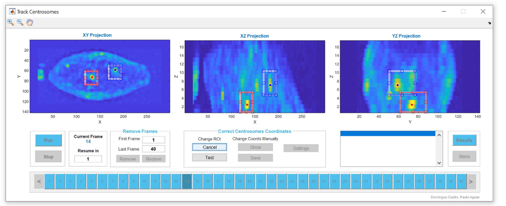

# Trackosome
A computational toolbox to study the spatiotemporal dynamics of centrosomes, nucleus and cellular membrane 

Domingos Castro, Vanessa Nunes, Joana T. Lima, Jorge G. Ferreira,  Paulo Aguiar

Journal of Cell Science, 2020

doi: https://doi.org/10.1242/jcs.252254

Trackosome is a freely available computational tool to track the centrosomes and reconstruct the nuclear envelope and cellular membranes, based on volumetric live-imaging data. The toolbox runs in MATLAB and provides a graphical user interface for easy and efficient access to the tracking and analysis algorithms. It outputs key metrics describing the spatiotemporal relations between centrosomes, nucleus and cellular membrane. Trackosome can also be used to measure the dynamic fluctuations of the nuclear envelope. Unlike previous algorithms based on circular/elliptical approximations of the nucleus, Trackosome measures membrane movement in a model-free condition, making it viable for irregularly shaped nuclei. Overall, Trackosome is a powerful tool to help unravel new elements in the spatiotemporal dynamics of subcellular structures.

*For help, please check the demostration videos in the folder: **_HowToUse_Demos**

Trackosome is composed of 3 main modules:
- **Centrosome Dynamics:** to calculate spatiotemporal relations between centrosomes, nucleus and cellular membrane in 3D
- **Membrane Fluctuations:** to measure the dynamic fluctuations of the nuclear envelope in 2D
- **Compile Data:** to compile data of Centrosome Dynamics module

To run Trackosome:

**1** - Open MATLAB

**2** - Change the MATLAB's working directory to where you have the Trackosome files

**3** - In MATLAB's command window run the GUI command (GUI_Main_Menu, GUI_FLUCT_Main_menu, or GUI_Compile_Data) of the component you want to use

If you use this software in your research please acknowledge Trackosome publication in Journal of Cell Science: Castro D, Nunes V, Lima J, Ferreira J, Aguiar P, 2020, "Trackosome: a computational toolbox to study the spatiotemporal dynamics of centrosomes, nucleus and cellular membrane", Journal of Cell Science, doi: https://doi.org/10.1242/jcs.252254

For questions, suggestions, and bug reports send an email to domingos.castro@i3s.up.pt or pauloaguiar@i3s.up.pt

Trackosome uses BioFormats, an incredible tool provided by The Open Microscopy Environment initiative
https://www.openmicroscopy.org/

!!! Always check for a new version of TRACKOSOME at: https://github.com/Trackosome !!!

Thank you for using TRACKOSOME!

THIS SOFTWARE IS PROVIDED "AS IS", WITHOUT WARRANTY OF ANY KIND, EXPRESS OR IMPLIED, INCLUDING BUT NOT LIMITED TO THE WARRANTIES OF MERCHANTABILITY, FITNESS FOR A PARTICULAR PURPOSE AND NONINFRINGEMENT. IN NO EVENT SHALL THE AUTHORS OR COPYRIGHT HOLDERS BE LIABLE FOR ANY CLAIM, DAMAGES OR OTHER LIABILITY, WHETHER IN AN ACTION OF CONTRACT, TORT OR OTHERWISE, ARISING FROM, OUT OF OR IN CONNECTION WITH THE SOFTWARE OR THE USE OR OTHER DEALINGS IN THE SOFTWARE.
